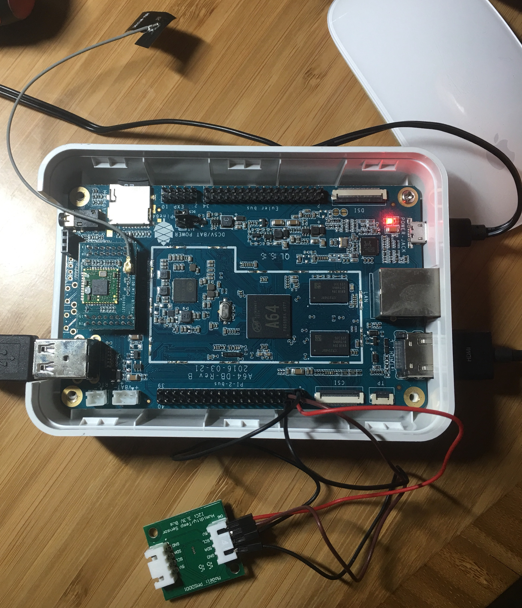

# Pine 64 - Temperature / Humidity Reader

This code reads the temperature and relative humidity from a Pine64 I2C PMSD001 sensor.

It's wired up via the Pi 2 bus as follows:

- Pin 3 - SDA
- Pin 4 - DC 5V
- Pin 5 - SCL
- Pin 6 - GND

Note that this I2C sensor can function also 3.3V, however, it is dangerous to use that pin on the GPIO as a pull up to 5V on a 3.3V pin can destroy the entire board. Use well-insulated connectors when connecting I2C this way.

## Building

    sudo apt-get -y install golang
    echo 'export GOPATH=$HOME/go' >> ~/.bashrc
    . ~/.bashrc
    go get golang.org/x/exp/io/i2c
    go build pmsd001.go

## Usage

    sudo ./pmsd001

returns e.g. `1612530062      21.18   70.12   48.1` where the tab-separated values are:
1. timestamp in UTC
2. temperature in °C
3. temperature in °F
4. relative humidity in %

## Useful Resources

- https://www.pine64.org/devices/single-board-computers/pine-a64/
- https://pine64.com/product/pine-a64-1gb-board/?v=0446c16e2e66
- https://en.wikipedia.org/wiki/Pine64
- https://web.archive.org/web/20180414015203/https://www.pine64.org/?product=pine64-humidity-temperature-sensor
- http://files.pine64.org/doc/Pine%20A64%20Schematic/Pine%20A64%20Pin%20Assignment%20160119.pdf
- http://wiki.pine64.org/index.php/POT
- https://dave.cheney.net/2014/08/03/tinyterm-a-silly-terminal-emulator-written-in-go

